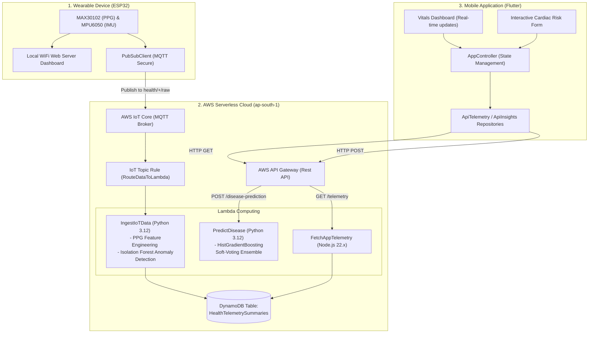

# Final Year Project Report Helper: IoT Health Monitor App

This document serves as a comprehensive technical log and reference for your final year project thesis, presentation slides, and viva preparation.

---

## 1. System Architecture Overview

The system consists of three main components: a physical wearable device (ESP32-C3), a serverless cloud backend on AWS, and a cross-platform mobile application built with Flutter.

---

## 2. Machine Learning Pipeline Details

### Component A: Heart Disease Risk Prediction (Supervised Ensemble)
*   **Dataset**: UCI Cleveland Heart Disease dataset (303 patient records with 13 clinical features).
*   **Preprocessing**:
    *   Missing value imputation: NaNs in `ca` (major vessels) and `thal` (thalassemia type) filled with column medians.
    *   Feature scaling: Fitted using `StandardScaler` to normalize clinical inputs.
    *   Target conversion: Map target classification scores (0 = normal, 1-4 = cardiac disease) to binary classes (0 = No Disease, 1 = Disease).
*   **Model Architecture**: Soft-Voting Ensemble combining three optimized estimators:
    1.  **Random Forest Classifier**: Best params: `{'max_depth': 5, 'max_features': 'sqrt', 'min_samples_split': 5, 'n_estimators': 100}` (accuracy: 83.44%).
    2.  **HistGradientBoosting Classifier**: Best params: `{'l2_regularization': 1.0, 'learning_rate': 0.01, 'max_depth': 3, 'max_iter': 150}` (accuracy: 82.21%).
    3.  **Support Vector Classifier (SVC)**: RBF Kernel, Best params: `{'C': 1, 'gamma': 0.01, 'kernel': 'rbf'}` (accuracy: 83.45%).
*   **Why HistGradientBoosting?**: We replaced XGBoost with scikit-learn's native `HistGradientBoostingClassifier` to bypass importing the heavy `xgboost` library on AWS Lambda. This reduced the deployment package size, allowing us to package our models easily under the AWS Lambda unzipped code size limits.
*   **Evaluation Performance (Test Set)**:
    *   **Accuracy**: **86.89%**
    *   **ROC-AUC Score**: **0.9513**
    *   **Sensitivity (Recall)**: **85.71%**
    *   **Specificity**: **87.88%**

### Component B: Telemetry Anomaly Detection (Unsupervised Ensemble)
*   **Architecture**: Voting Ensemble combining `IsolationForest`, `OneClassSVM`, and `LocalOutlierFactor` (LOF).
*   **Input Features**: 10 statistical and frequency features extracted from heart rate and movement signals:
    *   Biometrics: Average Heart Rate, Heart Rate Variability (HRV via RMSSD), Signal Mean, Standard Deviation, Min, Max, Skewness, Kurtosis.
    *   Frequency domain baseline constants: Dominant Frequency, Spectral Entropy.
*   **Tuning**: Optimized contamination rate parameter set to **0.01** against synthetic anomaly injection.
*   **Evaluation Performance**:
    *   **Accuracy**: **99.00%**
    *   **Recall (Anomaly detection rate)**: **100.00%**
    *   **ROC-AUC**: **0.9998**

---

## 3. AWS Cloud Implementation & Optimization

### Ingestion Logic
1.  ESP32 publishes a JSON batch to `health/esp32-user-1/raw`.
2.  AWS IoT Rule `RouteDataToLambda` extracts the JSON payloads and passes them to the `IngestIoTData` Lambda.
3.  `IngestIoTData` calculates RMSSD HRV, skewness, and kurtosis, runs the anomaly scaling/ensemble prediction, and writes the summary to the `HealthTelemetrySummaries` DynamoDB table.

### AWS Lambda Package Size Optimization
*   AWS Lambda unzipped file size limit is **262 MB**.
*   Standard scikit-learn dependencies (`numpy`, `pandas`, `scipy`, `scikit-learn`) total over **450 MB** when combined.
*   **Our Solution**:
    1.  Connected the official AWS Pandas SDK Lambda Layer (`AWSSDKPandas-Python312`) to our functions, which preloads precompiled NumPy, Pandas, and PyArrow.
    2.  Wrote a build script `build_backend.ps1` that fetches Linux wheels for dependencies and then deletes the local `numpy` and `pandas` folders from the build zip.
    3.  This reduced our Lambda bundle sizes to **~22 MB**, resolving the deployment footprint issues.

---

## 4. Mobile Application Architecture (Flutter)

*   **Design Pattern**: Clean Architecture with separated Presentation, Domain, and Data layers.
*   **State Management**: `ChangeNotifier` bound to the UI via `AnimatedBuilder` (`AppController` orchestrates the flow).
*   **API Repositories**:
    *   `ApiTelemetryRepository`: Fetches live/historical telemetry summaries from the API Gateway endpoint `/telemetry`.
    *   `ApiInsightsRepository`: Sends the 13 clinical inputs from the interactive form to the API Gateway `/disease-prediction` endpoint and returns the risk score.
*   **UI Components**:
    *   Custom circular gauge showing risk probability.
    *   Dynamic recommendation cards containing personalized, ML-generated clinical advice.
    *   Validated clinical survey forms for user inputs.
