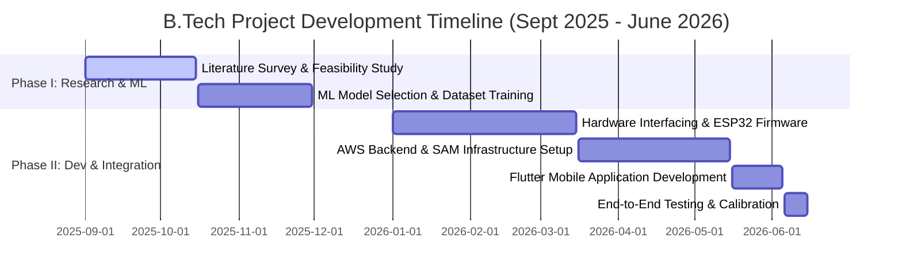

# Chapter 1: Introduction

## 1.1 Project Overview & Motivation
In the contemporary era of digital health transformation, real-time remote physiological monitoring has emerged as a cornerstone for preemptive cardiovascular diagnostics and personalized healthcare. Cardiovascular diseases (CVDs) remain the leading cause of global mortality, accounting for an estimated 17.9 million deaths annually. A significant percentage of these fatalities are preventable if early pathological indicators—such as heart rate elevation, arterial oxygen saturation ($\text{SpO}_2$) degradation, and physical activity abnormalities—are detected in real-time. 

Traditional clinical monitoring solutions are predominantly centralized, requiring patients to be physically present in clinical facilities. This setup is not only resource-intensive but also fails to capture transient, intermittent anomalies (e.g., occasional cardiac arrhythmia or sudden hypoxic events) that occur during regular daily activities. While consumer-grade health wearables (smartwatches, fitness bands) have proliferated, they exhibit critical technical limitations:
1. **Raw Telemetry Overhead**: Constant transmission of high-frequency raw sensor readings (accelerometer, photoplethysmography waveforms) to the cloud rapidly depletes battery life and consumes excessive network bandwidth.
2. **Lack of Local Intelligence**: Many devices act as basic "data pipes" that rely entirely on internet connectivity to derive health metrics, rendering them ineffective in remote or low-connectivity zones.
3. **Proprietary and Opaque Algorithms**: The proprietary nature of commercial wearable software hinders medical customization, academic auditing, and clinical integration.

To address these challenges, this project presents the design and development of an intelligent, secure, and serverless **Hybrid Edge-Cloud IoT Health Monitoring System**. The system utilizes a dual-sensor wearable device built on the Espressif ESP32 microcontroller, interfacing with a MAX30102 PPG sensor and an MPU6050 Inertial Measurement Unit (IMU). By distributing processing between the edge (ESP32) and a serverless cloud infrastructure (Amazon Web Services), the proposed architecture achieves real-time, low-latency step counting and activity classification locally, while delegating heavy machine learning computations (biometric anomaly detection and heart disease risk prediction) to secure cloud functions.

---

## 1.2 Problem Statement
The integration of wearable biomedical sensors with Internet of Things (IoT) architectures presents several engineering challenges that must be addressed:

### 1.2.1 Limitations of Traditional Wearables
Traditional wearable systems operate under a centralized paradigm where raw sensor telemetry is continuously pushed to cloud databases. For high-frequency inertial data (typically sampled at 10Hz to 50Hz) and PPG waveforms, continuous transmission leads to high radio transceiver duty cycles. This results in thermal constraints, high battery drain, and network congestion. Furthermore, such systems exhibit high latency during critical events, as warning triggers must travel to the cloud, undergo database validation, and return to the client app.

### 1.2.2 The Need for Hybrid Edge-Cloud Processing
A hybrid paradigm is required to partition the workload:
1. **Edge Node**: The local microcontroller must process raw, high-frequency acceleration signals to count steps and recognize the user's current activity (Resting, Walking, Jogging) using resource-efficient heuristics. This reduces the cloud ingestion payload to a low-frequency summary transmitted every 5 seconds.
2. **Cloud Node**: The cloud backend must ingest this summary securely, extract biometric features (such as Heart Rate Variability via RMSSD), run unsupervised anomaly detection to identify statistical deviations from a baseline, and execute supervised ML ensembles on clinical survey inputs to assess overall cardiovascular risks.

The application must bridge this edge-cloud gap by providing a cross-platform mobile user interface that updates dynamically in real-time, offering instant medical warnings and personalized clinical feedback.

---

## 1.3 Objectives of the Project
The primary engineering objectives of this project are:
* **Hardware Co-Design**: Interface the classic ESP32 microcontroller with the MAX30102 pulse oximeter and the MPU6050 accelerometer/gyroscope over a shared Inter-Integrated Circuit ($\text{I}^2\text{C}$) serial bus, reassigning pins to GPIO 21 (SDA) and GPIO 22 (SCL) to ensure noise-free communication.
* **Edge Algorithm Development**: Implement a dynamic, hysteresis-based peak detection algorithm and sliding window feature extraction on the ESP32 to calculate step counts and classify movement activities locally without cloud dependency.
* **Local HTTP Server Design**: Develop a non-blocking web server on the ESP32 hosting an HTML/JS dashboard that shows live step metrics and activity labels over the local WiFi network.
* **Secure Cloud Integration**: Establish a secure MQTT over TLS ($x.509$ client certificate authenticated) telemetry stream to AWS IoT Core.
* **Serverless Cloud Analytics**: Design and deploy AWS Lambda functions in Python and Node.js to ingest IoT data, calculate heart rate variability (RMSSD), execute an Isolation Forest voting ensemble for biometric anomaly detection, and write summaries to Amazon DynamoDB.
* **Supervised Risk Prediction**: Implement a soft-voting machine learning ensemble combining Random Forest, Histogram-based Gradient Boosting, and Support Vector Machine (SVM) classifiers on AWS to predict heart disease risk from clinical data.
* **Cross-Platform Visualization**: Build a responsive Flutter mobile application that consumes the AWS API Gateway endpoints to display live sensor values, step counts, and cardiac risk predictions dynamically.

---

## 1.4 Scope and Significance
The scope of this project extends across the domains of embedded systems engineering, cloud computing, and applied machine learning. The significance of the system lies in its:
* **Resource Optimization**: Local edge processing reduces data transmission volume by over 90%, significantly extending the wearable's battery runtime.
* **Improved Anomaly Detection**: By comparing physical movement (from the IMU) with PPG biometric parameters, the system minimizes false-positive clinical alerts. For instance, high heart rate during jogging is classified as normal, whereas high heart rate while resting is flagged as an anomaly.
* **Low-Cost and Reusable Design**: Built using low-cost, off-the-shelf components, the system offers an affordable solution for rural telemedicine and home care monitoring.
* **Scalable Serverless Backend**: The AWS SAM-based cloud backend automatically scales with the number of deployed wearable devices, incurring zero idle-state costs.

---

## 1.5 Project Timeline & Gantt Chart
The project was executed over a ten-month period spanning from September 2025 to June 2026. The timeline is divided into two primary phases: Phase I (focused on literature survey, model training, and ML pipeline development) and Phase II (focused on hardware interfacing, local firmware, cloud serverless integration, and mobile application assembly).

Below is the project's timeline and progress schedule represented as a Gantt chart:

### Milestone Breakdowns
* **September 1, 2025 - October 15, 2025**: Literature review on health telemetry and machine learning architectures. Selected MAX30102 and MPU6050 sensors.
* **October 16, 2025 - November 30, 2025**: Trained the soft-voting classifier ensemble on the UCI Cleveland dataset. Formulated and tested the Isolation Forest anomaly detector.
* **January 1, 2026 - March 15, 2026**: Circuit design, PCB layout planning, and breadboard interfacing of sensors to the classic ESP32. Developed local step-counting and activity heuristics.
* **March 16, 2026 - May 15, 2026**: Set up the AWS SAM project, deployed IoT Core rules, Lambda functions, DynamoDB tables, and API Gateway endpoints. Optimized Python dependencies to fit Lambda size limits.
* **May 16, 2026 - June 5, 2026**: Developed the Flutter mobile app interface. Integrated state management and HTTP API repositories.
* **June 6, 2026 - June 15, 2026**: Conducted end-to-end integration testing, resolved release build permissions (internet permissions), and finalized telemetry calibration.

---

## 1.6 Report Organization
The remainder of this report is organized into the following chapters:
* **Chapter 2 (Theoretical Background & Components)** describes the fundamental operating principles of photoplethysmography (PPG), inertial sensing, the Inter-Integrated Circuit ($\text{I}^2\text{C}$) bus, AWS serverless technologies, and the mathematical foundations of the Isolation Forest and ensemble learning models.
* **Chapter 3 (System Design & Methodology)** details the architectural layout, data flow diagrams (DFDs), UML sequence diagrams, and mathematical formulations for edge feature extraction and cloud analytics.
* **Chapter 4 (Hardware & Firmware Implementation)** presents circuit schematics, pin maps, and the C++ firmware codebase for signal filtering, local step detection, activity classification, and secure MQTT communication.
* **Chapter 5 (Cloud and Software Integration)** explains the AWS SAM infrastructure setup, python Lambda functions (including the custom unpickling logic), API gateway mappings, database schemas, and the Flutter clean architecture code.
* **Chapter 6 (Results, Testing, and Evaluation)** presents the experimental results, ML model accuracy scores, latency metrics, database snapshots, and user interface verification screenshots.
* **Chapter 7 (Conclusions & Future Scope)** summarizes the project contributions, highlights current limitations, and outlines future avenues of research.
* **Bibliography** lists all academic publications, book references, and technical datasheets used in the project.
