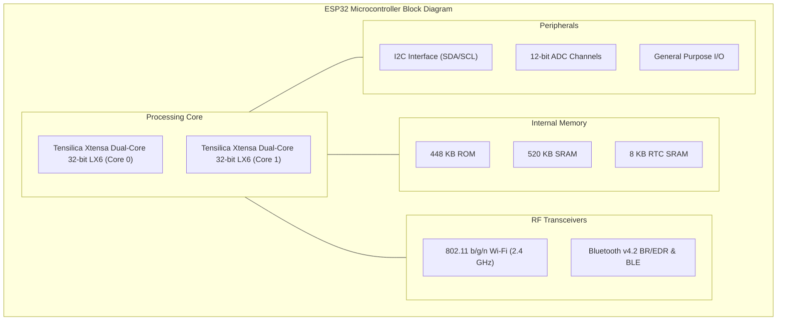

# Chapter 2: Theoretical Background & Components

## 2.1 Overview of Internet of Things (IoT) in Healthcare
The paradigm of Internet of Things (IoT) in healthcare, often referred to as the Internet of Medical Things (IoMT), represents an interconnected infrastructure of medical devices, software applications, and health systems. The core architecture of IoMT systems is traditionally structured into three layers:
1. **Perception Layer (Sensor Node)**: Physical sensors in contact with the patient gather analog physiological data and convert it into digitized packets.
2. **Network Layer (Transmission Node)**: Secure communication channels (WiFi, Bluetooth Low Energy, cellular networks) route data from local nodes to intermediate gateways or remote cloud servers.
3. **Application Layer (Processing & Visualization Node)**: Cloud backends store, process, and analyze the telemetry, exposing visual summaries via mobile dashboards and alerting clinical stakeholders.

Applying IoMT to continuous cardiac care is of paramount significance. Traditional medical diagnostic tools, such as Holter monitors, provide retrospective analysis over a 24 to 48-hour window but are bulky and lack real-time warning capabilities. Modern IoMT architectures overcome these limitations, enabling continuous, non-invasive vital signs tracking during a patient's daily life.

---

## 2.2 Hardware Architecture & Sensor Components

### 2.2.1 ESP32 Microcontroller: Architecture and Features
The Espressif ESP32 is a low-cost, low-power system-on-chip (SoC) microcontroller with integrated Wi-Fi and dual-mode Bluetooth. It serves as the primary edge computing node in this system.



**Technical Specifications:**
* **Processor**: Tensilica Xtensa dual-core 32-bit LX6 microprocessor, operating at 160 or 240 MHz. In this project, it is clocked at 240 MHz to manage simultaneous sensor polling, local step-counting heuristics, local HTTP server execution, and TLS encrypted cloud uploads.
* **Memory**: 520 KB of internal SRAM. The dual-core CPU architecture allows core-pinning: Core 0 executes network tasks (WiFi client, secure MQTT handshake) while Core 1 performs high-frequency sensor reading and mathematical calculations (peak detection, rolling buffers).
* **Peripherals**: Includes analog-to-digital converters (ADC), digital-to-analog converters (DAC), $\text{I}^2\text{C}$ bus controllers, and Serial Peripheral Interfaces (SPI). 

### 2.2.2 MAX30102 Photoplethysmography (PPG) Sensor Working Principle
The MAX30102 is an integrated pulse oximetry and heart-rate monitor sensor module. It operates on the principle of **Photoplethysmography (PPG)**—the optical measurement of arterial volume changes during the cardiac cycle.

```
       MAX30102 Sensor Module
   +-------------------------------+
   |   [Red LED]       [IR LED]    |
   |     660nm          880nm      |
   |       |              |        |
   |       v              v        |
   |    ~~~~~~~~~~~~~~~(Skin)~~~~  |
   |       |              |        |
   |       +-----\  /-----+        |
   |              \/               |
   |        [Photodetector]        |
   |               |               |
   |               v               |
   |     [18-bit ADC Converter]    |
   |               |               |
   |               v               |
   |         I2C Registers         |
   +-------------------------------+
```

**Operating Physics:**
1. **Light Emission**: The sensor integrates two Light Emitting Diodes: a **Red LED** (660 nm wavelength) and an **Infrared (IR) LED** (880 nm wavelength).
2. **Light Absorption & Hemoglobin State**:
   * Oxygenated hemoglobin ($\text{HbO}_2$) absorbs more infrared light and allows red light to pass through.
   * Deoxygenated hemoglobin ($\text{Hb}$) absorbs more red light and allows infrared light to pass through.
3. **Photodetector**: A high-sensitivity photodiode measures the light intensity reflected or transmitted through the tissue. During the systole phase of the cardiac cycle, heart contraction pushes oxygenated blood to peripheral capillaries, increasing $\text{SpO}_2$ volume and light absorption (resulting in a photodetector intensity minimum). During diastole, capillary blood volume decreases, reducing light absorption (resulting in a photodetector intensity maximum).
4. **Digitization**: An internal 18-bit Analog-to-Digital Converter (ADC) digitizes the optical signals, transmitting the raw values via $\text{I}^2\text{C}$.
5. **Saturation Calculation ($\text{SpO}_2$)**: The oxygen saturation is computed using the "Ratio of Ratios" ($R$) formula:
   $$R = \frac{\left( \frac{AC_{\text{Red}}}{DC_{\text{Red}}} \right)}{\left( \frac{AC_{\text{IR}}}{DC_{\text{IR}}} \right)}$$
   $$\text{SpO}_2\% = A - B \cdot R$$
   where $AC$ represents the time-varying components (due to arterial pulses), $DC$ represents the constant baseline (due to bone, muscle, and venous blood), and $A, B$ are calibration constants empirically determined for the sensor.

### 2.2.3 MPU6050 Inertial Measurement Unit (IMU): Working Principle
The MPU6050 is a Micro-Electro-Mechanical Systems (MEMS) sensor combining a 3-axis accelerometer and a 3-axis gyroscope on a single silicon die.

* **Accelerometer Working Principle**: It measures linear acceleration along the X, Y, and Z axes. Internally, MEMS accelerometers consist of a movable "proof mass" suspended on silicon springs between fixed capacitive plates. When linear force is applied, the proof mass displaces, changing the differential capacitance. An internal circuit converts this change into voltage, which is digitized by a 16-bit ADC.
* **Gyroscope Working Principle**: It measures angular velocity (rotation rate) around the X, Y, and Z axes based on the **Coriolis Effect**. When the sensor rotates, a Coriolis force acts on an internally vibrating mass, inducing a mechanical displacement. The displacement alters capacitance, which is converted to a digital output.
* **Application in Step Counting**: In our system, the MPU6050 is polled at 10Hz. The 3D acceleration vector $\vec{a} = [a_x, a_y, a_z]$ is converted into gravity-compensated net magnitude:
   $$\text{Mag} = \sqrt{a_x^2 + a_y^2 + a_z^2} - 1.0g$$
   By tracking fluctuations in this magnitude over time, step peaks are detected dynamically.

### 2.2.4 Inter-Integrated Circuit ($\text{I}^2\text{C}$) Communication Protocol
$\text{I}^2\text{C}$ is a synchronous, multi-master, multi-slave, packet-switched, single-ended serial communication bus. 

```
               Pull-Up Resistors
               +3.3V  +3.3V
                 |      |
                 R      R
                 |      |
   +-------------v------v-------------+
   |             |      |             |
   |   SDA  -----+------+-------------+----> Serial Data (SDA)
   |   SCL  -----+------+-------------+----> Serial Clock (SCL)
   |             |      |             |
   +-------------+------+-------------+
                 |      |
         +-------v------+-------+
         |                      |
   +-----+------+         +-----+------+
   |   MAX30102 |         |   MPU6050  |
   |   (0x57)   |         |   (0x68)   |
   +------------+         +------------+
```

**Bus Architecture:**
* **SDA (Serial Data)**: Bidirectional line for data transfer.
* **SCL (Serial Clock)**: Unidirectional clock line driven by the master (ESP32).
* **Pull-Up Resistors**: Both lines require pull-up resistors (typically $4.7\text{ k}\Omega$ to $10\text{ k}\Omega$) connected to $V_{DD}$ to pull the lines high when inactive.
* **Addressing**: Each slave on the bus has a unique 7-bit address. The master initiates communication by sending a start condition, followed by the slave address and a Read/Write bit:
  * **MAX30102 Slave Address**: `0x57`
  * **MPU6050 Slave Address**: `0x68`
* **Classic ESP32 Pins**: In our hardware modification, SDA is mapped to Pin 21 and SCL is mapped to Pin 22.

---

## 2.3 Cloud Computing & Database Technologies

### 2.3.1 AWS IoT Core Message Broker & MQTT Protocol
AWS IoT Core is a managed cloud service that lets connected devices interact securely with cloud applications.
* **MQTT (Message Queuing Telemetry Transport)**: A lightweight pub-sub network protocol designed for low-bandwidth, high-latency, or unreliable networks.
* **QoS (Quality of Service) Levels**: We use **QoS 1** ("At least once delivery") to ensure critical step counts and anomaly events are successfully transmitted to the broker.
* **TLS Security**: AWS IoT Core enforces transport security. Connections must use **TLS v1.2** or v1.3 with client-side $x.509$ certificates and private keys generated by the AWS Certificate Manager (ACM). The ESP32 utilizes the `WiFiClientSecure` library to perform asymmetric cryptography and establish a secure socket connection.

### 2.3.2 AWS Lambda Serverless Computing
AWS Lambda is an event-driven, serverless computing platform.
* **Function-as-a-Service (FaaS)**: Code runs in micro-containers that initialize on demand (cold starts) and scale automatically to handle millions of requests without manual provisioning.
* **Execution Trigger**: The `IngestIoTData` Lambda is triggered by an AWS IoT Rule when a message is published to `health/+/raw`. It decodes the JSON payload, computes heart rate variability, runs the Isolation Forest model, and updates DynamoDB.

### 2.3.3 Amazon DynamoDB NoSQL Database
DynamoDB is a fully managed, multi-region NoSQL database that provides single-digit millisecond latency.
* **Data Partitioning**: The table `HealthTelemetrySummaries` is keyed on:
  * **Partition Key (PK)**: `deviceId` (String) — isolates telemetry records for each patient.
  * **Sort Key (SK)**: `timestamp` (String) — stores records chronologically, enabling time-series queries.
* **Schema-less Nature**: Supports varying document structures, which is ideal for storing raw readings, filtered biometrics, and activity classification strings in a single record.

---

## 2.4 Machine Learning Foundations

### 2.4.1 Unsupervised Anomaly Detection: Isolation Forest
The **Isolation Forest (iForest)** algorithm isolates anomalies instead of profiling normal data points. 

```
               Isolation Forest Partitioning
      Feature Y
        ^
        |   . . .   .
        |  .  *  . . .     <-- Normal points (high density,
        |   . . * . .          requires many splits to isolate)
        |  . . . . .
        |
        |        *         <-- Anomaly (isolated, requires
        |                          very few splits)
        +----------------------------------------> Feature X
```

**Mathematical Formulation:**
Given a training dataset $X = \{x_1, \dots, x_n\}$ of $n$ instances in a $d$-dimensional space, the algorithm recursively partitions the space by randomly selecting a feature and a split value between the minimum and maximum values of that feature. This recursive partitioning is represented as an Isolation Tree (iTree).

Anomalies are easier to isolate and therefore appear closer to the root of the tree. The anomaly score $s(x, n)$ of an instance $x$ is defined as:
$$s(x, n) = 2^{-\frac{\mathbb{E}(h(x))}{c(n)}}$$
where:
* $h(x)$ is the path length (number of edges from the root to the leaf node) of instance $x$ in an iTree.
* $\mathbb{E}(h(x))$ is the expected (average) path length of $x$ across a forest of iTrees.
* $c(n)$ is the average path length of an unsuccessful search in a Binary Search Tree (BST) built with $n$ nodes:
  $$c(n) = 2\ln(n - 1) + 0.5772156649 - \frac{2(n - 1)}{n}$$
  where $0.5772156649$ is Euler's constant.

**Decision Boundaries:**
* If $s(x, n) \to 1$: The expected path length $\mathbb{E}(h(x)) \to 0$. The instance is classified as an **anomaly**.
* If $s(x, n) < 0.5$: The expected path length is large. The instance is classified as **normal**.

### 2.4.2 Supervised Cardiac Risk Assessment Ensemble Models

#### 2.4.2.1 Random Forest Classifier
Random Forest is a bagging ensemble method that constructs multiple decision trees during training.
* **Bootstrap Aggregation (Bagging)**: Each tree is trained on a random bootstrap sample of the training data.
* **Feature Randomness**: At each node split, only a random subset of features is considered.
* **Decision Rule**: The final classification probability $P(Y = c \mid x)$ is the average of individual tree probabilities:
  $$P(Y = c \mid x) = \frac{1}{T} \sum_{t=1}^{T} P_t(Y = c \mid x)$$

#### 2.4.2.2 Histogram-based Gradient Boosting
This algorithm bins continuous features into integer bins (typically 256 bins), reducing the number of split points.
* **Complexity Reduction**: The tree construction complexity drops from $\mathcal{O}(n_{\text{samples}} \cdot n_{\text{features}})$ to $\mathcal{O}(n_{\text{bins}} \cdot n_{\text{features}})$.
* **Gradient Step**: At each iteration $m$, the model fits a new weak learner $h_m(x)$ to the negative gradients (pseudo-residuals) of the loss function:
  $$r_{im} = -\left[ \frac{\partial L(y_i, F(x_i))}{\partial F(x_i)} \right]_{F(x) = F_{m-1}(x)}$$
* **AWS Lambda Performance**: This implementation significantly reduces memory usage, making it ideal for AWS Lambda containers.

#### 2.4.2.3 Support Vector Classifier (SVC)
SVC finds the optimal separating hyperplane that maximizes the margin between classes.
* **Optimization Formulation**:
  $$\min_{w, b, \xi} \frac{1}{2} \|w\|^2 + C \sum_{i=1}^{n} \xi_i$$
  subject to:
  $$y_i (w^T \phi(x_i) + b) \ge 1 - \xi_i, \quad \xi_i \ge 0$$
  where $\xi_i$ are slack variables and $C$ controls the trade-off between margin width and classification errors.
* **Kernel Trick**: We use the Radial Basis Function (RBF) kernel to map inputs to a high-dimensional space:
  $$K(x_i, x_j) = \exp(-\gamma \|x_i - x_j\|^2)$$

---

## 2.5 Literature Survey & Research Gaps

To establish the academic context of our project, we reviewed five prominent publications in the field of IoT-based vital signs monitoring:

| Ref | Author & Year | Methodology / Stack | Core Findings | Limitations / Gaps |
| :--- | :--- | :--- | :--- | :--- |
| **[1]** | Selvam et al. (2025) | AD8232 ECG + ESP32 + Ubidots Cloud | Demonstrated real-time ECG waveform transmission to Ubidots for clinical alert generation. | Required heavy cloud resources; lacked local edge analytics; did not measure movement or SpO2. |
| **[2]** | Kumar et al. (2024) | MAX30100 + NodeMCU + DHT11 + Custom Web Server | Implemented AES-encryption at the microcontroller level before sending vitals to the cloud. | Lacked machine learning anomaly detection; DHT11 is not medical grade; limited scaling. |
| **[3]** | Zahhad et al. (2021) | Arduino + ESP8266 + Blynk Cloud | Developed a low-cost vital signs monitor (HR, SpO2, Temp) utilizing Blynk for user interface. | Relied entirely on third-party Blynk IoT templates; lacked custom state machine logic; no edge step detection. |
| **[4]** | Ananth et al. (2019) | Smartwatch + ThingSpeak + IFTTT | Used ThingSpeak channels to route patient alerts and trigger SMS notifications via IFTTT. | High latency in alert delivery (>10s); no support for batch data processing; lack of biometric feature extraction. |
| **[5]** | Wan et al. (2018) | Wearable IoT System (WISE) + Cloud Database | Proposed a wearable framework that operates independently without a smartphone. | High power consumption due to continuous cellular/WiFi radio activity; lacked local sensor comparisons. |

### Research Gaps Identified
Based on our literature survey, we identified several critical gaps in existing IoMT designs:
1. **Lack of Local Physical Context**: Most systems process vital signs (heart rate, oxygen levels) in isolation. Without physical activity context (e.g., whether the user is resting, walking, or jogging), systems generate excessive false alarms during normal exertion.
2. **High Bandwidth & Cost Overhead**: Continuous transmission of raw signals drains device battery and increases cloud costs.
3. **Absence of Serverless Custom AI Pipelines**: Existing research often uses simple threshold triggers or commercial IoT dashboards (Blynk, ThingSpeak), lacking secure, custom ML architectures for biometric anomaly detection.

Our project addresses these gaps by implementing a hybrid edge-cloud architecture that performs step counting and activity recognition locally on the ESP32 while routing secure data to custom serverless ML models in the cloud.
