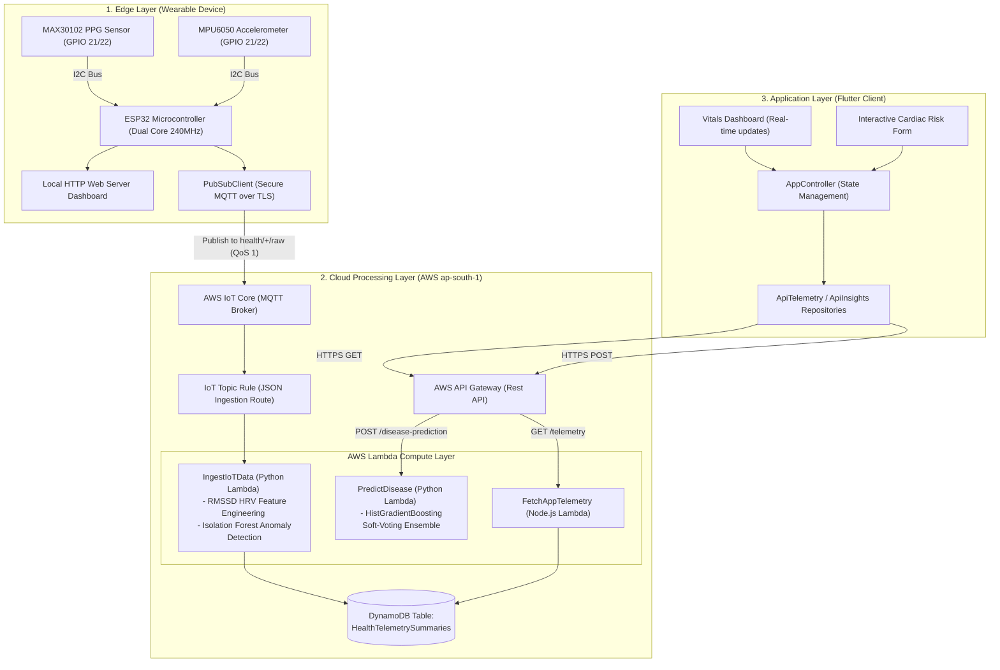
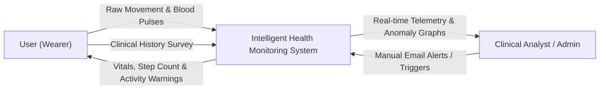
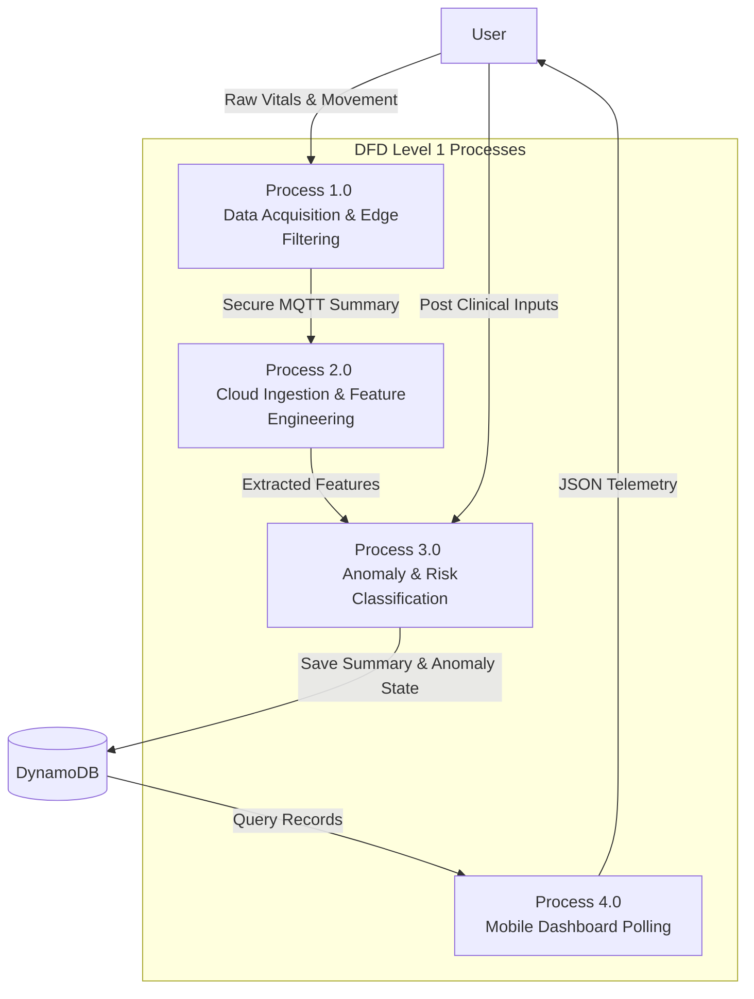
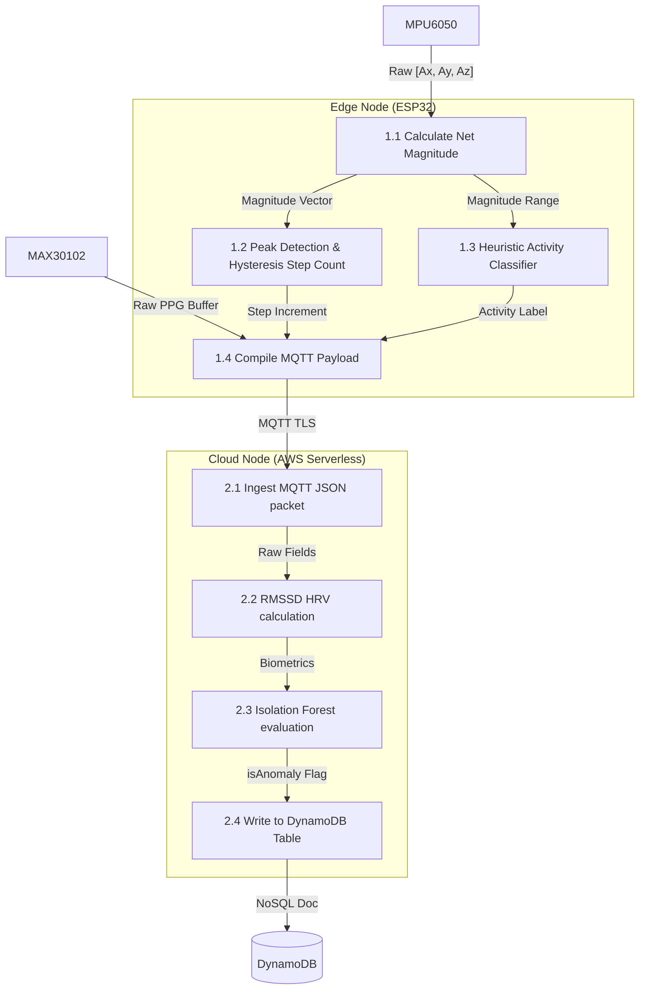
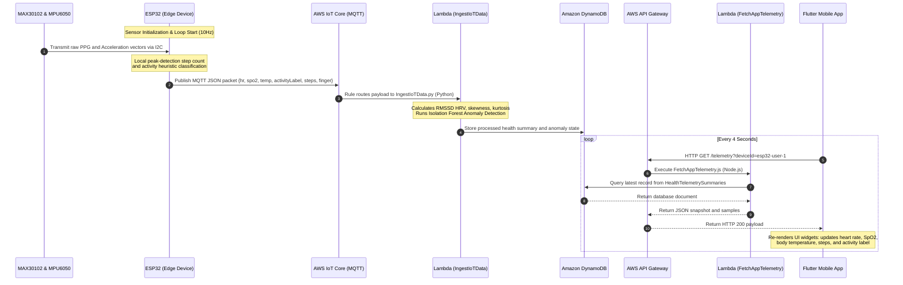

# Chapter 3: System Design & Methodology

## 3.1 Proposed Hybrid Edge-Cloud Architecture
The proposed architecture adopts a hybrid edge-cloud paradigm to balance low-latency processing, network bandwidth conservation, and intensive machine learning tasks. The processing tasks are distributed across a three-tier topology:
1. **Edge Wearable Device (ESP32)**: Handles high-frequency physical data collection, filters sensor noise, implements a peak-detection algorithm to count steps, and classifies activities locally.
2. **Serverless Cloud Layer (AWS)**: Ingests data packets securely, extracts statistical biometric features (e.g., HRV), and runs machine learning models for anomaly detection and cardiac risk prediction.
3. **Client Visualization (Flutter)**: Refreshes dynamically to render live data, trends, and clinical warnings.

---

## 3.2 Data Flow Diagrams (DFD)

### 3.2.1 DFD Level 0 (Context Diagram)
The Context Diagram defines the boundary of the system, showing the data exchanges between the health monitor system and external entities.

### 3.2.2 DFD Level 1 (Data Flow Overview)
The Level 1 DFD decomposes the system into main functional processes: acquisition, cloud ingestion, inference, and visualization.

### 3.2.3 DFD Level 2 (Detailed Flow)
The Level 2 DFD details the internal operations of the edge and cloud processing nodes.

---

## 3.3 Unified Modeling Language (UML) Sequence Diagram
The sequence diagram illustrates the dynamic interactions and messages exchanged between components over time.

---

## 3.4 Edge-Side Data Processing Methodology

### 3.4.1 Gravity-Compensated Acceleration Magnitude
To detect steps and classify movement independently of the wearable's physical orientation, the raw three-dimensional linear acceleration vector $\vec{a}(t) = [a_x(t), a_y(t), a_z(t)]$ is projected into a one-dimensional scalar magnitude. This is achieved by computing the Euclidean norm of the vector and subtracting the constant gravitational acceleration ($1.0g$ in calibrated accelerometer units):
$$\text{Mag}(t) = \sqrt{a_x(t)^2 + a_y(t)^2 + a_z(t)^2} - 1.0g$$
Subtracting gravity isolates the dynamic acceleration components resulting from user movement.

### 3.4.2 Sliding Window & Peak-to-Peak Feature Extraction
To analyze movement patterns, a sliding window $W$ of size $N = 10$ is maintained, representing a 1-second duration at a 10 Hz sampling rate. At each time step $t$, the window contains the historical magnitude values:
$$W_t = \{\text{Mag}(t - N + 1), \dots, \text{Mag}(t)\}$$
The peak-to-peak magnitude range (fluctuation) is extracted across this window:
$$\text{Range}_t = \max_{x \in W_t} (x) - \min_{x \in W_t} (x)$$
This parameter serves as the primary metric for activity classification.

### 3.4.3 Peak-Detection and Hysteresis Step Count Algorithm
Steps are counted by identifying acceleration peaks. The algorithm employs a dynamic thresholding mechanism with hysteresis to filter out minor fluctuations:
1. **Peak Condition**: A step is registered at time $t$ if the magnitude peaks and exceeds a dynamic threshold $\theta_{\text{step}}$:
   $$\text{Mag}(t) > \text{Mag}(t-1) \quad \text{AND} \quad \text{Mag}(t) > \text{Mag}(t+1) \quad \text{AND} \quad \text{Mag}(t) > \theta_{\text{step}}$$
2. **Hysteresis Window**: To prevent double-counting steps due to sensor noise or high-frequency vibrations during a single stride, a lockout window of $300\text{ ms}$ is enforced:
   $$\Delta t_{\text{last\_step}} > 300\text{ ms}$$

### 3.4.4 Heuristic Edge Activity Classification
The movement state is classified on the edge using the computed magnitude range:
* **Resting**: $\text{Range}_t < 0.18g$. The user is stationary or sitting.
* **Walking**: $0.18g \le \text{Range}_t \le 0.60g$. Typical range during rhythmic walking.
* **Jogging**: $\text{Range}_t > 0.60g$. High-intensity linear movement.

---

## 3.5 Cloud-Side Data Ingestion & Analytics Pipeline

### 3.5.1 Biometric Feature Extraction & HRV Calculation (RMSSD)
Upon receiving the telemetry data, the cloud ingestion Lambda function extracts statistical features from the physiological signals. The primary index for cardiac health and autonomic nervous system regulation is **Heart Rate Variability (HRV)**, calculated using the **Root Mean Square of Successive Differences (RMSSD)** between adjacent heartbeat intervals:
$$\text{RMSSD} = \sqrt{\frac{1}{M - 1} \sum_{i=1}^{M-1} (RR_{i+1} - RR_i)^2}$$
where $RR_i$ is the $i$-th heartbeat interval (in milliseconds) derived from the PPG peaks. 

Additionally, the Lambda function calculates the skewness and kurtosis of the incoming signal buffer to assess signal quality and filter out artifacts:
$$\text{Skewness} = \frac{\frac{1}{k}\sum_{j=1}^k (x_j - \mu)^3}{\sigma^3}$$
$$\text{Kurtosis} = \frac{\frac{1}{k}\sum_{j=1}^k (x_j - \mu)^4}{\sigma^4}$$

### 3.5.2 Ensembled Anomaly Isolation Pipeline
To evaluate if incoming telemetry is anomalous, the cloud ingestion Lambda implements an unsupervised Isolation Forest voting ensemble. Features including average heart rate, $\text{SpO}_2$, temperature, and RMSSD HRV are evaluated. The model returns an anomaly score $s(x, n)$ for each record. If $s(x, n) \ge 0.55$, the record is flagged as anomalous.

To prevent false alarms when the user is not actively wearing the device, a bypass check is executed. If the MAX30102 sensor reports `fingerDetected: false`, the anomaly detection pipeline is bypassed. In this case, `isAnomaly` is set to `false`, vitals default to `0.0`, and the database summary reads: *"Wearable active. Place finger on sensor for vitals."*

### 3.5.3 Ensembled Cardiac Risk Inference Pipeline
For heart disease risk prediction from clinical survey inputs, the system uses a soft-voting ensemble classifier. The soft-voting mechanism averages the predicted class probabilities of three base models: Random Forest (RF), Histogram-based Gradient Boosting (HGB), and Support Vector Machine (SVC).

The ensembled probability $\hat{P}(Y = 1 \mid x)$ is computed as:
$$\hat{P}(Y = 1 \mid x) = w_{\text{RF}} P_{\text{RF}}(Y = 1 \mid x) + w_{\text{HGB}} P_{\text{HGB}}(Y = 1 \mid x) + w_{\text{SVC}} P_{\text{SVC}}(Y = 1 \mid x)$$
where:
* $P_m(Y = 1 \mid x)$ is the probability predicted by model $m$ that class $Y = 1$ (Heart Disease Present).
* $w_m$ represents the relative model weights ($\sum w_m = 1$). In this implementation, uniform weights are applied: $w_{\text{RF}} = w_{\text{HGB}} = w_{\text{SVC}} = \frac{1}{3}$.

---

## 3.6 Client-Side Mobile Application Architecture
The Flutter mobile application uses a clean, decoupled architecture:
* **Presentation Layer**: UI screens (Dashboard, Assessment, Insights) bind to the state management controller.
* **Domain Layer**: Contains business logic, entity models (`HealthSnapshot`, `TelemetrySample`), and repository contracts.
* **Data Layer**: Implements repository contracts, managing data retrieval from local memory (`LocalStorage`) or remote APIs (`ApiTelemetryRepository` and `ApiInsightsRepository`).
* **State Management**: Implements the `ChangeNotifier` pattern, notifying listeners to trigger UI updates when new telemetry is fetched from AWS API Gateway.
