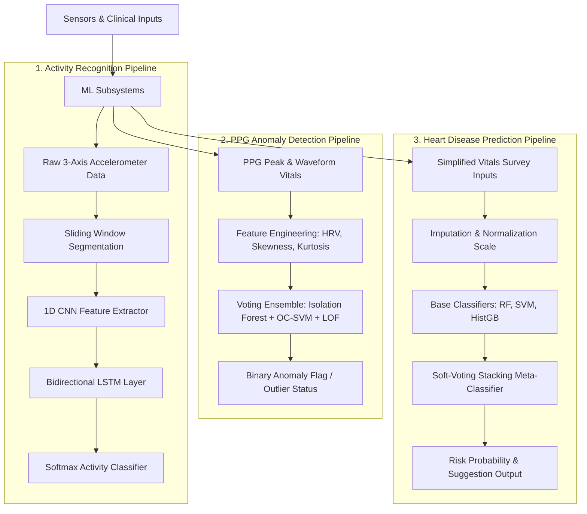

# Section 3: System Design & Methodology — Machine Learning Pipeline

This document provides a comprehensive, copy-paste-ready section for **Section 3: System Design & Methodology** of your B.Tech project report. It details the mathematical foundations, architectural descriptions, and end-to-end working processes of the three machine learning pipelines integrated into the Health Monitor application.

---

## 3.X Machine Learning Methodology

To enable comprehensive health monitoring, the system implements a multi-tier Machine Learning (ML) architecture. The ML pipeline consists of three specialized systems, each serving a distinct medical or diagnostic purpose:
1. **Activity Recognition Model**: A deep temporal network classifying physical motion to contextualize metabolic demand.
2. **PPG Anomaly Detection Model**: An unsupervised ensemble flagger detecting physiological outliers in heart rate and PPG waveforms.
3. **Heart Disease Prediction Model**: A soft-voting stacking ensemble classifier calculating cardiac risk assessment probabilities based on clinical parameters.

---

### 3.X.1 Activity Recognition Model (1D CNN + BiLSTM)

The physical activity recognition system identifies the user's current physical state to ensure that physiological spikes (such as elevated heart rate) are correctly contextualized. For example, a heart rate of 120 BPM is normal during jogging, but is flagged as an anomaly if the user is resting.

#### Mathematical & Algorithmic Foundation
* **1D Convolutional Neural Network (1D CNN)**: 
  Unlike 2D CNNs used for spatial images, 1D CNNs apply convolutional kernels along a single temporal dimension. The mathematical operation of a 1D convolution on a time-series input $x$ of length $L$ with a kernel $w$ of size $K$ is defined as:
  $$y[t] = \sum_{k=0}^{K-1} w[k] \cdot x[t - k]$$
  This operation acts as an automated feature extractor, identifying local temporal patterns (e.g., repeating peaks from strides) across the accelerometer signals.
  
* **Bidirectional Long Short-Term Memory (BiLSTM)**:
  LSTMs are recurrent neural networks designed to process sequential data while mitigating vanishing gradients using gating mechanisms. A standard LSTM cell controls information flow using Input ($i_t$), Forget ($f_t$), and Output ($o_t$) gates:
  $$f_t = \sigma(W_f \cdot [h_{t-1}, x_t] + b_f)$$
  $$i_t = \sigma(W_i \cdot [h_{t-1}, x_t] + b_i)$$
  $$\tilde{C}_t = \tanh(W_c \cdot [h_{t-1}, x_t] + b_c)$$
  $$C_t = f_t * C_{t-1} + i_t * \tilde{C}_t$$
  $$o_t = \sigma(W_o \cdot [h_{t-1}, x_t] + b_o)$$
  $$h_t = o_t * \tanh(C_t)$$
  *Bidirectional LSTMs* run two separate LSTM layers on the input sequence: one forward in time ($\vec{h}_t$) and one backward in time ($\overleftarrow{h}_t$). This allows the network to capture both past and future context at any given timestamp:
  $$H_t = [\vec{h}_t \,||\, \overleftarrow{h}_t]$$

#### Detailed Working Process & Workflow
1. **Sensor Ingestion**: The ESP32's MPU6050 accelerometer samples 3-axis acceleration data ($a_x$, $a_y$, $a_z$) at $20\text{ Hz}$.
2. **Segmentation**: Raw streams are segmented using a sliding window of $128$ samples (~6.4 seconds of motion) with a $50\%$ overlap ($64$ samples step size) to preserve boundary features.
3. **Deep Feature Extraction**: The segmented window is passed to three stacked 1D Convolutional layers ($64$, $128$, and $256$ filters, kernel size = $5$, activation = ReLU) to extract hierarchy motion features. Dropout layers ($0.5$) are applied to prevent overfitting.
4. **Temporal Dependency Modeling**: The extracted feature maps are fed into a Bidirectional LSTM layer ($128$ hidden units) to capture sequential structure and context of the physical movement in both forward and reverse directions.
5. **Softmax Classification**: The final output is passed to a Dense layer with a Softmax activation function, generating probability distributions across 6 activity classes: *Walking, Jogging, Upstairs, Downstairs, Sitting, and Standing*.

---

### 3.X.2 PPG Anomaly Detection Model (Ensemble Outlier Detector)

PPG signals and raw vitals can be noisy or contain transient spikes due to motion artifacts, sensor disconnects, or sudden physiological crises. The PPG Anomaly Detection subsystem acts as an unsupervised gatekeeper to classify whether incoming biometric feature vectors represent normal variations or statistical outliers.

#### Mathematical & Algorithmic Foundation
To maximize detection robustness, the pipeline aggregates three distinct unsupervised outlier detection paradigms in a majority voting ensemble:

* **Isolation Forest (iForest)**:
  Isolation Forest isolates anomalies instead of profiling normal data points. It recursively partitions the dataset by randomly selecting a feature and a split value. Because anomalies lie in sparse regions of the feature space, they require fewer partitions to isolate. The anomaly score $s(x, n)$ for a sample $x$ over $n$ trees is calculated as:
  $$s(x, n) = 2^{-\frac{E(h(x))}{c(n)}}$$
  where $E(h(x))$ is the average path length of $x$ across the forest, and $c(n)$ is the average path length of an unsuccessful search in a Binary Search Tree (BST) built on $n$ nodes. A score close to $1.0$ indicates a highly isolated anomaly.
  
* **One-Class Support Vector Machine (OC-SVM)**:
  One-Class SVM maps the feature vectors into a high-dimensional kernel space $\Phi(x)$ and finds the optimal hyperplane that separates the normal data points from the origin with maximum margin. The optimization objective is defined as:
  $$\min_{w, \xi, \rho} \, \frac{1}{2} \|w\|^2 + \frac{1}{\nu n}\sum_{i=1}^n \xi_i - \rho$$
  $$\text{subject to } \langle w, \Phi(x_i) \rangle \ge \rho - \xi_i, \quad \xi_i \ge 0$$
  where $\nu \in (0, 1]$ controls the trade-off between the fraction of training outliers and the margin, and $\rho$ is the offset parameter.
  
* **Local Outlier Factor (LOF)**:
  LOF measures the local density deviation of a data point with respect to its $k$-nearest neighbors. The local reachability density ($\text{lrd}$) of point $p$ is defined as:
  $$\text{lrd}_k(p) = \frac{|N_k(p)|}{\sum_{o \in N_k(p)} \text{reach-dist}_k(p, o)}$$
  The LOF score is the average ratio of the $\text{lrd}$ of the neighbors of $p$ to the $\text{lrd}$ of $p$:
  $$\text{LOF}_k(p) = \frac{\sum_{o \in N_k(p)} \frac{\text{lrd}_k(o)}{\text{lrd}_k(p)}}{|N_k(p)|}$$
  A score substantially greater than $1.0$ indicates that the point is in a significantly sparser region than its neighbors.

#### Detailed Working Process & Workflow
1. **Telemetry Parsing**: The ingest Lambda function parses incoming vital streams containing heart rate, SpO2, and temperature from DynamoDB.
2. **Feature Engineering**: Calculates additional temporal descriptors such as Heart Rate Variability (HRV) using the root mean square of successive differences (RMSSD) of raw peak intervals, alongside signal skewness and kurtosis.
3. **Scaling**: Standardizes the 10-dimensional feature vector using a pre-saved StandardScaler ($z = (x - \mu) / \sigma$).
4. **Ensemble Voting Inference**: 
   * The feature vector is passed to the three models (`IsolationForest`, `OneClassSVM`, and `LocalOutlierFactor`).
   * Each model outputs a binary prediction ($+1$ for normal, $-1$ for outlier).
   * A **Majority Voting Rule** combines the predictions: if two or more models flag the sample as $-1$, the sample is classified as an anomaly.
5. **Flag Ingestion**: If flagged as an anomaly, the database entry is marked `isAnomaly = true`, triggering immediate alerts on the Flutter Dashboard and notifications to the user.

---

### 3.X.3 Heart Disease Prediction Model (Stacking Ensemble Classifier)

This model provides clinical risk assessment. When a user submits their vitals survey, a stacking ensemble classifier analyzes the biometric risk factors to predict the probability of underlying coronary artery disease.

#### Mathematical & Algorithmic Foundation
The classifier utilizes a **Stacking Classifier** framework with a meta-estimator to combine the predictions of three highly diverse base estimators:

* **Random Forest (RF)**:
  An ensemble bagging classifier that trains multiple independent decision trees on bootstrap samples. By averaging individual tree outputs, RF reduces model variance:
  $$\hat{p}(y=1|x) = \frac{1}{B}\sum_{b=1}^{B} P_b(y=1|x)$$
  
* **Support Vector Machine (SVM)**:
  A classifier that constructs a separating hyperplane in a high-dimensional space. To calculate probabilities, Platt scaling is applied, fitting a logistic regression model on the SVM decision values $f(x)$:
  $$P(y=1|x) = \frac{1}{1 + \exp(A \cdot f(x) + B)}$$
  
* **Histogram-based Gradient Boosting (HistGB)**:
  A boosting algorithm that groups continuous input values into integer-valued bins (histograms). This significantly reduces training complexity and optimizes tree node splits using gradients ($g_i$) and Hessians ($h_i$):
  $$\mathcal{L}^{(t)} \approx \sum_{i=1}^{n} \left[ g_i f_t(x_i) + \frac{1}{2} h_i f_t^2(x_i) \right] + \Omega(f_t)$$

* **Meta-Estimator (Logistic Regression Stacking)**:
  The stacking classifier trains the base models using $k$-fold cross-validation. The out-of-fold probability predictions of the base estimators are concatenated to form a new feature vector:
  $$Z = [P_{\text{RF}}(x), \, P_{\text{SVM}}(x), \, P_{\text{HistGB}}(x)]$$
  A final Meta-Classifier (Logistic Regression) is trained on $Z$ to output the final heart disease prediction:
  $$\hat{y} = \sigma(W_{\text{meta}} \cdot Z + b_{\text{meta}})$$
  $$\text{where } \sigma(z) = \frac{1}{1 + e^{-z}}$$

#### Detailed Working Process & Workflow
1. **Vitals Input Ingestion**: The mobile user completes a 7-field vitals survey (Age, Sex, Chest Pain Type, Exercise Angina, Resting Blood Pressure, Cholesterol, and Max Heart Rate).
2. **Background Context Padding**: The Flutter app automatically appends standard healthy defaults for the remaining 6 complex clinical fields (Fasting Blood Sugar = `0.0`, Resting ECG = `0.0`, ST depression `oldpeak` = `0.0`, ST segment slope = `1.0`, major vessels `ca` = `0.0`, and Thalassemia score `thal` = `3.0`).
3. **Scaling**: The Lambda function standardizes the 13 inputs using the pre-fit `heart_scaler.pkl`.
4. **Base Estimator Inference**: The scaled vector is passed to the cached base models (Random Forest, SVM, HistGradientBoosting) which calculate individual classification probabilities.
5. **Meta-Estimator Aggregation & Output**: The meta-estimator (Logistic Regression) blends the base probabilities, outputting the final calibrated **Risk Probability** and diagnostic label (Low, Moderate, or High Risk).
